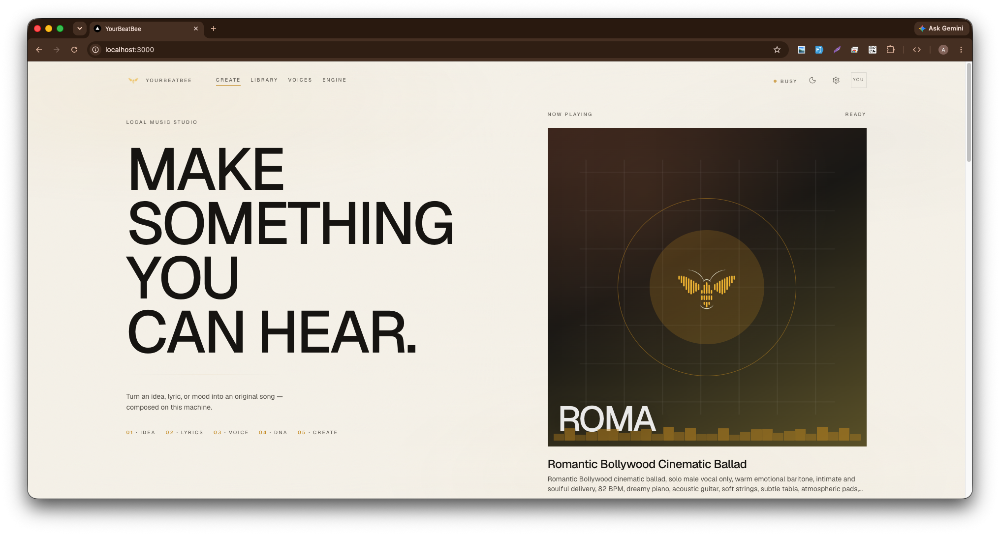
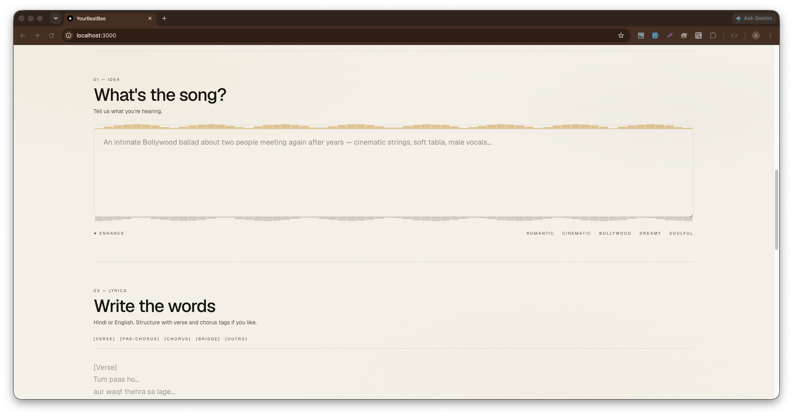

# YourBeatBee

**Local AI music studio** — turn an idea, lyrics, and a voice into an original song **on your own machine**.

Built for open-source users who want studio-quality text-to-music without sending prompts to a cloud API. Choose between two local engines: **[ACE-Step 1.5](https://github.com/ACE-Step/ACE-Step-1.5)** (best on Apple Silicon MLX/MPS) or **[HeartMuLa](https://github.com/HeartMuLa/heartlib)** (strong lyric control; best on CUDA). Optional **My Voice** via imported RVC models.

**Repository:** [github.com/MohamedAshraf701/yourbeatbee](https://github.com/MohamedAshraf701/yourbeatbee)

<p align="center">
  
</p>

<p align="center">
  <a href="https://github.com/MohamedAshraf701/yourbeatbee/stargazers"></a>
  <a href="https://github.com/MohamedAshraf701/yourbeatbee/issues"></a>
  <a href="https://github.com/MohamedAshraf701/yourbeatbee"></a>
</p>

<p align="center">
  <a href="#quick-start"><strong>Quick start</strong></a> ·
  <a href="#features"><strong>Features</strong></a> ·
  <a href="#how-it-works"><strong>How it works</strong></a> ·
  <a href="#tech-stack"><strong>Tech stack</strong></a> ·
  <a href="docs/PROJECT.md"><strong>Full docs</strong></a>
</p>

---

## Screenshots

| Studio home | Create flow |
|-------------|-------------|
|  |  |

---

## Why this project?

Most “AI music” products run inference in the cloud. **YourBeatBee** keeps generation **local**:

- No ACE-Step SaaS / REST host  
- No Hugging Face Space as the runtime  
- Weights download once → songs are written under `data/songs/` on disk  

Open-source path: clone → `npm install` → `npm run studio` → finish **Setup** in the browser.

---

## Features

- **Create** — song idea, lyrics (Hindi / English), voice, language, duration, Song DNA (style lock, weirdness, tempo)
- **Library** — play, search, and download generated tracks
- **Voices** — import an RVC model for **My Voice** (real singer identity after generation)
- **Engine** — hardware detection, DiT / LM recommendations, install & download from UI, apply & restart, stop / unload
- **Local-first** — jobs as JSON files; Python worker loads ACE-Step into RAM
- **Light & dark** studio UI with brand assets and social share cards

---

## How it works

```text
Browser (YourBeatBee UI)
        │
        ▼
  Next.js API  ──writes──►  data/jobs/{id}.json
        │
        ▼
  Python engine (ACE-Step)
        │
        ├── generate_music(...)
        ├── optional: Demucs → RVC → remix  (My Voice)
        └── writes data/songs/{id}.mp3 (+ metadata)
        │
        ▼
  UI plays / downloads via /api/songs/...
```

1. You fill **Idea**, **Lyrics**, **Voice**, **DNA**, then **Create the song**.  
2. The app queues a job in `data/jobs/`.  
3. `engine/worker.py` (already loaded) picks it up and runs ACE-Step.  
4. Audio lands in `data/songs/`. With **My Voice**, vocals are converted with your RVC model after the mix is generated.

Deep dive: **[docs/PROJECT.md](docs/PROJECT.md)** (architecture, APIs, settings, RVC, env vars).

---

## Tech stack

| Layer | Stack |
|-------|--------|
| **Studio UI** | Next.js 16, React 19, TypeScript, Tailwind CSS 4, shadcn/ui |
| **Local API** | Next.js App Router route handlers |
| **Engine** | Python, [uv](https://docs.astral.sh/uv/), ACE-Step 1.5 |
| **Apple Silicon** | MLX / MPS (PyTorch / CUDA experimental) |
| **My Voice** | Demucs + rvc-python (isolated Python 3.10 env) |
| **Persistence** | JSON + audio files under `data/` (no required DB) |

---

## Requirements

| Requirement | Notes |
|-------------|--------|
| **macOS Apple Silicon** | Primary target |
| **Node.js 20+** | Studio + APIs |
| **[uv](https://docs.astral.sh/uv/)** | ACE-Step deps (Python 3.11–3.12); RVC uses 3.10 |
| **Disk** | Several GB for model weights on first run |
| **RAM** | 16GB+ unified memory recommended (Setup suggests 0.6B vs 1.7B) |
| **ffmpeg** (optional) | MP3 export; otherwise WAV |

---

## Quick start

```bash
git clone https://github.com/MohamedAshraf701/yourbeatbee.git
cd yourbeatbee
npm install
npm run studio
```

1. Open **[http://localhost:3000](http://localhost:3000)**  
2. Complete the **Setup** wizard (detect hardware → pick **ACE-Step or HeartMuLa** → install → start engine)  
3. Wait until the engine badge shows **ready**  
4. Go to **Create** and generate your first song  

`npm run studio` starts the Next.js UI and the Python engine together. Stopping it (Ctrl+C) unloads the engine so model RAM is freed. Starting studio again first clears any leftover workers so memory does not stack.

Switch engines anytime under **Engine** (Apply & restart). Only the active family is loaded into memory.

### Optional CLI setup

Power users can install from the terminal instead of (or before) the wizard:

```bash
# ACE-Step (Mac-friendly default)
npm run setup:engine
npm run download:models

# HeartMuLa (CUDA preferred)
npm run setup:heartmula
npm run download:heartmula

npm run studio
```

Or run processes separately:

```bash
npm run engine    # terminal A — loads models, watches data/jobs/
npm run dev       # terminal B — UI only
```

### First-run tips

- The first weight download can take a while; you should see per-file progress.  
- Avoid `HF_HUB_ENABLE_HF_TRANSFER=1` — it often looks stuck with no logs.  
- Ctrl+C and re-run downloads are safe (resumable).  
- Closing the studio tab unloads the engine (page leave + ~90s idle fallback).
- Ctrl+C on `npm run studio` always runs `npm run engine:stop` and frees RAM.
- Only one engine worker is allowed — a new start kills orphans first.

---

## Project structure

```text
musicai/
├── app/                 # Next.js pages + API routes
├── components/studio/   # Create, Library, Voices, Engine UI
├── lib/                 # Jobs, songs, settings, models, supervisor
├── engine/              # Python worker, compose, download, RVC
├── scripts/             # setup-engine, start-engine, download-models
├── public/brand/        # Logos + OG/Twitter banners
├── public/screenshots/  # README screenshots
├── docs/PROJECT.md      # Full project documentation
├── data/                # Runtime (jobs, songs, settings) — local
└── vendor/              # ACE-Step, heartlib, rvc-env after setup — local
```

---

## npm scripts

| Script | What it does |
|--------|----------------|
| `npm run studio` | UI + engine together (unloads engine on exit) |
| `npm run dev` | Next.js only |
| `npm run engine` | Start worker for the **active** engine family |
| `npm run engine:stop` | Force-unload engine / free RAM |
| `npm run setup:engine` | Clone ACE-Step, sync deps, setup RVC |
| `npm run setup:heartmula` | Clone HeartMuLa heartlib + venv |
| `npm run setup:rvc` | RVC / Demucs env only |
| `npm run download:models` | Download ACE-Step DiT / LM weights |
| `npm run download:heartmula` | Download HeartMuLa 3B + HeartCodec |
| `npm run typecheck` | TypeScript check |
| `npm run lint` / `format` | ESLint / Prettier |

---

## Model recommendations (Setup)

| Machine | Engine | Notes |
|---------|--------|--------|
| Apple Silicon (MPS) | **ACE-Step** | Turbo + 0.6B / 1.7B by RAM. HeartMuLa is CUDA-oriented. |
| CUDA ≥ 16GB VRAM | **HeartMuLa** (or ACE-Step) | HeartMuLa 3B + Codec; ACE Turbo + 1.7B also fine |
| CUDA &lt; 16GB VRAM | HeartMuLa + lazy-load, or ACE 0.6B | Enable lazy-load in Engine settings |
| CPU-only | ACE-Step 0.6B | Slow; HeartMuLa not practical |

### ACE-Step DiT / LM

| Machine | DiT | LM |
|---------|-----|-----|
| MPS, RAM &lt; 24GB | Turbo | 0.6B |
| MPS, 24–31GB | Turbo | 0.6B (1.7B advanced) |
| MPS, ≥ 32GB | Turbo | 1.7B |
| CUDA ≥ 16GB VRAM | Turbo | 1.7B |
| Low VRAM / CPU | Turbo | 0.6B |

Choices are saved in `data/settings.json` (`engineFamily`: `ace` \| `heartmula`). Env vars like `ACESTEP_LM_MODEL_PATH` still override ACE when set — see [docs/PROJECT.md](docs/PROJECT.md).

---

## My Voice (RVC)

ACE-Step does **not** clone your real singing voice from a short mic clip.

For true My Voice:

1. Train an **RVC v2** model (e.g. Google Colab / RVC WebUI on CUDA)  
2. Download the zip (`.pth` + optional `.index`)  
3. Import it under **Voices** / **My Voice** in the studio  
4. Generate with **My Voice** selected  

Pipeline: ACE-Step mix → Demucs separate → RVC convert → remix.

---

## Configuration

Optional environment overrides (win over UI settings when already set):

| Variable | Purpose |
|----------|---------|
| `ACESTEP_CONFIG_PATH` | DiT model id |
| `ACESTEP_LM_MODEL_PATH` | LM model id |
| `ACESTEP_LM_BACKEND` | `mlx` or `pt` |
| `ACESTEP_DEVICE` | `mps` / `cuda` / `cpu` |
| `NEXT_PUBLIC_SITE_URL` | Absolute URL for Open Graph / Twitter cards |

---

## Documentation

| Doc | Contents |
|-----|----------|
| **[docs/PROJECT.md](docs/PROJECT.md)** | Full guide: architecture, APIs, data layout, RVC, scripts, license notes |
| **This README** | Open-source overview, screenshots, quick start |

---

## Contributing

Issues and PRs are welcome. For larger changes, open an issue first.

Suggested flow:

1. Fork and create a branch  
2. `npm install` · `npm run typecheck` · `npm run lint`  
3. Keep UI and engine changes focused; update docs when behavior changes  

---

## License & disclosure

- **YourBeatBee / studio app code** in this repo — use under the terms you publish with the repository.  
- **ACE-Step** — MIT (see `vendor/ACE-Step-1.5/LICENSE` after setup).  
- **HeartMuLa / heartlib** — see upstream license in `vendor/heartlib` after setup.  
- **Generated audio** — treat as AI-assisted; verify originality and rights before commercial use.  
- **Imported RVC models** — you are responsible for training data consent and likeness rights.

---

<p align="center">
  <sub>YourBeatBee — local music, composed on this machine.</sub>
</p>
